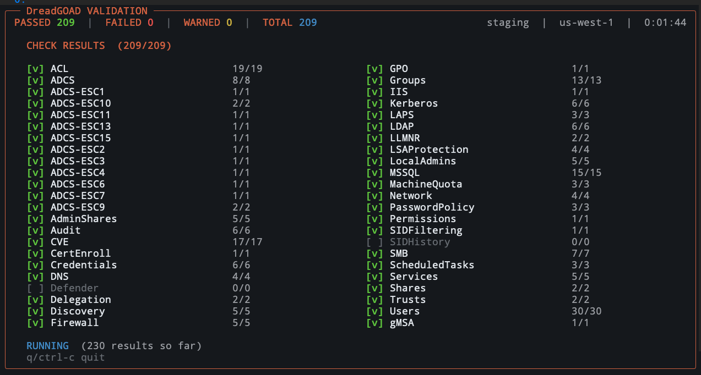
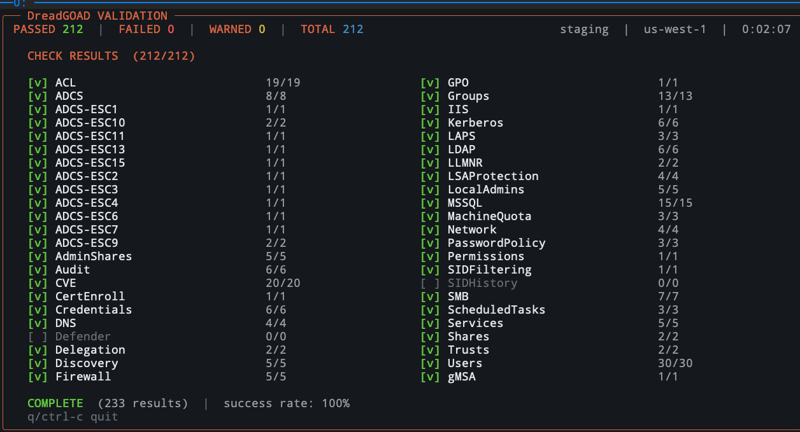

# GOAD Vulnerability Validation

`dreadgoad validate` runs SSM/Run-Command PowerShell checks against a live
lab to confirm the 50+ vulnerabilities in
[`GOAD-vulnerabilities-comprehensive.md`](./GOAD-vulnerabilities-comprehensive.md)
are wired up correctly.

## Quick Start

```bash
dreadgoad validate                # full validation, active env
dreadgoad validate --env dev      # specific environment
dreadgoad validate --quick        # critical vulnerabilities only
dreadgoad validate --verbose      # extra per-check detail
dreadgoad validate --no-fail      # always exit 0
```

### Live Dashboard

When stdout is a TTY, `dreadgoad validate` opens a live Bubbletea/Lipgloss
dashboard with a per-category PASS/FAIL/WARN breakdown, a running success
rate, and a footer that switches between `RUNNING`, `WAITING`, and
`COMPLETE`. Categories with no applicable checks render with a dim `[ ]`
marker instead of `[v]`.




```bash
# Disable the dashboard and stream results to stdout
dreadgoad validate --plain

# Re-run every 5 minutes on the same dashboard (minimum 1m)
dreadgoad validate --poll 5m
```

Keys: `q`, `ctrl+c`, or `esc` to quit. The JSON report on disk is the
canonical record; it is rewritten at the end of each pass and the path is
printed on exit.

`--poll` requires the live dashboard (ignored with `--plain` or non-TTY).
Intervals shorter than `1m` are rejected. Accepted "off" values: `never`,
`off`, `no`, `false`, `0`, `0s`, or empty.

## What Gets Validated

The dashboard screenshots above show the live category set. The major
attack surfaces covered:

- **Credentials**: passwords in description fields, weak policies, spray
- **Kerberos**: AS-REP roasting, kerberoasting, SPNs
- **SMB / LLMNR / Network**: SMB signing, NTLM relay, name-resolution poisoning
- **Delegation**: unconstrained, constrained, RBCD, `MachineAccountQuota`
- **MSSQL**: services, impersonation, sysadmins, trusted links
- **ADCS**: installation, web enrollment, ESC1/2/3/4/6/7/8/9/10/11/13/15 templates
- **ACL abuse**: `ForceChangePassword`, `GenericWrite`, `WriteDacl`, `WriteOwner`, GPO
- **Trusts**: parent/child, forest trust, cross-forest membership, SID history
- **Services & misc**: IIS, Print Spooler, LDAP signing, WebClient, gMSA, LAPS

See [`GOAD-vulnerabilities-comprehensive.md`](./GOAD-vulnerabilities-comprehensive.md)
for the full catalog with exploitation details.

## JSON Report

Every run writes a JSON report to `/tmp/goad-validation-<timestamp>.json`
(or `--output <path>`):

```json
{
  "validation_date": "2026-05-11T16:45:00Z",
  "environment": "staging",
  "total_checks": 233,
  "passed": 212,
  "failed": 0,
  "warnings": 0,
  "checks": [
    {
      "status": "PASS",
      "category": "Credentials",
      "name": "password_in_description",
      "detail": "samwell.tarly has password in description"
    }
  ]
}
```

`status` is one of `PASS`, `FAIL`, `WARN`, `SKIP`, `INFO`. Exit code is
`0` when no checks failed (or `--no-fail` is set), `1` otherwise.

## Troubleshooting

### "Could not find all required domain controllers"

Instances not running or SSM not accessible.

```bash
dreadgoad lab status
aws ssm describe-instance-information --filters "Key=tag:Name,Values=*goad*"
```

### SSM command timeouts

Check network connectivity to the instances and verify WinRM is running.
A full pass takes a couple of minutes; the dashboard footer or `--plain`
output shows progress.

### Many checks failing or warning

Vulnerabilities likely not fully provisioned. Re-run the vulnerability
plays:

```bash
dreadgoad provision --plays vulnerabilities.yml
dreadgoad provision --plays vulnerabilities.yml --limit dc02
```

## Manual Validation

If automated validation fails, you can manually verify vulnerabilities:

### 1. SSM into a Domain Controller

```bash
aws ssm start-session --target <instance-id> --region <your-region>
```

### 2. Run PowerShell Checks

```powershell
# Check AS-REP Roasting
Get-ADUser -Filter * -Properties DoesNotRequirePreAuth |
  Where-Object {$_.DoesNotRequirePreAuth -eq $true}

# Check Kerberoasting
Get-ADUser -Filter * -Properties ServicePrincipalName |
  Where-Object {$_.ServicePrincipalName}

# Check SMB Signing
Get-SmbServerConfiguration

# Check delegation
Get-ADUser -Filter * -Properties TrustedForDelegation,TrustedToAuthForDelegation

# Check Machine Account Quota
$domain = Get-ADDomain
$dn = "CN=Directory Service,CN=Windows NT,CN=Services,CN=Configuration,$($domain.DistinguishedName)"
Get-ADObject $dn -Properties ms-DS-MachineAccountQuota |
  Select-Object -ExpandProperty ms-DS-MachineAccountQuota
```

## Related Documentation

- [`GOAD-vulnerabilities-comprehensive.md`](./GOAD-vulnerabilities-comprehensive.md) - Complete vulnerability catalog
- [`cli.md`](./cli.md) - CLI usage and configuration reference
- [`scoreboard.md`](./scoreboard.md) - Live engagement status board (the agent-facing counterpart to `validate`)
- [GOAD Official Docs](https://github.com/Orange-Cyberdefense/GOAD) - Upstream documentation
- [Mayfly's Walkthrough Series](https://mayfly277.github.io/categories/goad/) - Attack technique guides
